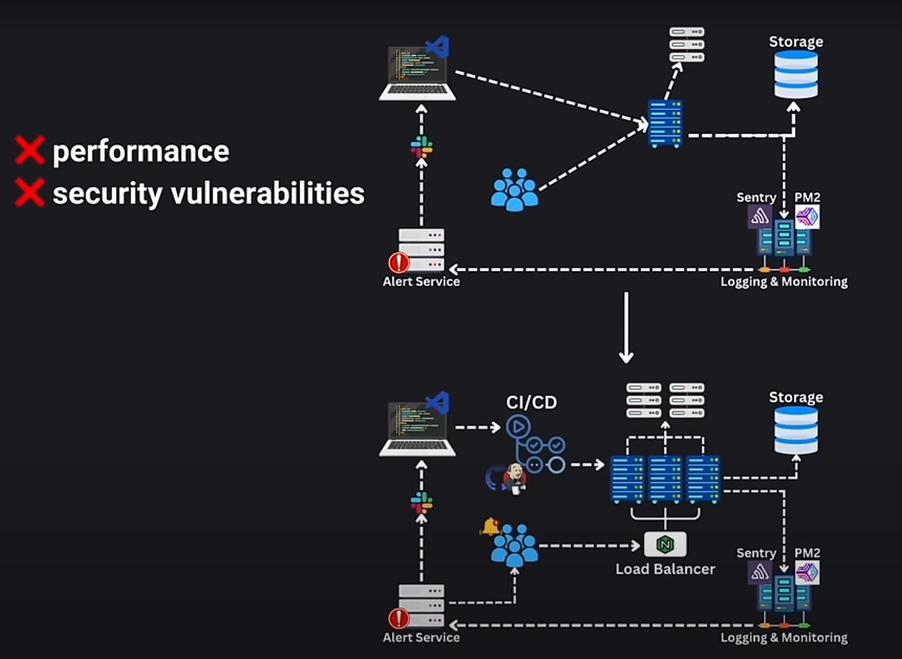

# High Level Architechture.

1. CI/CD: Continous integration and deployment, normaly handle by jenkins or github Actions.

- This should include and Stagin Area for testing.

2. Production Server: Servers where your app is running, it usually handles the app and the web server like Nginx. It is linked to load balancers to handle the request of the users.
3. Database Storage server usually separated.
4. Other servers, normally third party ones.
5. Logging & Monitoring Systems to keep the app healthy storing logs and analyzing data. Also having a backup of the logs helps debugging when its necesary.
6. Alert Service for bugs, errores, attacks and similar events.
7. Notification channels for developers.

If a bug arises, the alert system sends a notification to the developers so they can use the logs and the monitoring system info to detect the bug and reproduce it on the staging area. That way they can make a patch for this bug, so productio enviroment works while they create a full solution for the bug. This avoids the users the inconvinience of the bug fix.

This is the basic High Level architecture for a production app in a company. It could be smaller if needed. It could be composed of:

- one server: App, database, Nginx, logs.
- one staging area
- CI/CD (optionally)...

For small projects. You should use just enough to handle your software needs.

# Good Design

In a good design we are focusing on three main principles:

1. Scalability: User growth and app growing with the user base.
2. Maintainability: How fast the dev team can fix, mantain and improve the app. And the onboarding of the tech stack.
3. Efficiency: Wise use of the resources.
4. Reliability: Planning for failure and having a system that mantains its composure when things go wrong.

## Three Key Elements:

1. Moving Data: data should flow seamlessly from one part of the app to another.
2. Storing Data: Saving data and having backups
3. Transforming Data: Safely transforming existing data.

## CAP theorem

1. Avaliabilyty
2. Redundancy
3. Reliability
4. Scalability

This is the point where docker, kubernets and similar tools are a good part of an stack.
